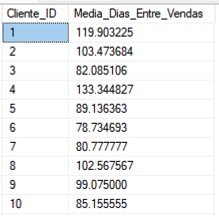
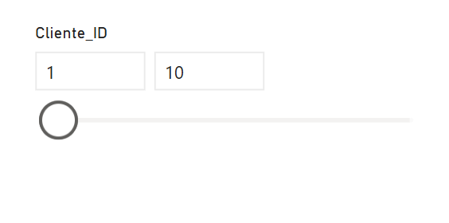

# Dias entre vendas por clientes

> [!NOTE]
> Repositório criando por Alison Pezzott em resposta ao questionamento em https://discord.com/channels/1279778182941245503/1332361733645537440  


## Download da base

Faça o download do arquivo [vendas.csv](https://github.com/alisonpezzott/intervalo-medio-clientes/blob/main/vendas.csv)  
Extraia e coloque o arquivo dentro da pasta `C:/Temp/`.   


## SQL

Adicionamos os dados em uma tabela no banco de dados com 

```sql
IF NOT EXISTS ( SELECT * FROM sys.databases WHERE name = 'sandbox' )
BEGIN
    CREATE DATABASE sandbox;
END
GO

USE sandbox;
GO

DROP TABLE IF EXISTS vendas;
GO

CREATE TABLE vendas (       
	Venda_ID INT, 
	Data DATE, 
	Cliente_ID INT, 
	Loja_ID INT, 
    Produto_ID INT,
	Valor MONEY 
); 

GO 

BULK INSERT vendas 
FROM 'C:/Temp/vendas.csv' 
WITH (     
	CODEPAGE = '65001',     
	FIELDTERMINATOR = ';',      
	FIRSTROW = 2  
); 
```


Executamos a query abaixo para simples verificação.  

```sql
SELECT TOP (100) * FROM vendas;

SELECT COUNT (*) FROM vendas;

```

Vamos rodar agora o código para encontrar a média de tempo entre vendas por cliente.  

```sql
WITH CTE_DataVendaAnterior AS (
    SELECT 
        Cliente_ID,
        Venda_ID,
        Data,
        COALESCE (
            LAG ( Data ) OVER ( PARTITION BY Cliente_ID ORDER BY Data ASC ),
            Data
        ) AS Ultima_Data_Venda
    FROM vendas
),
CTE_DifDias AS (
    SELECT 
        Cliente_ID,
        Venda_ID,
        Data,
        Ultima_Data_Venda,
        DATEDIFF ( DAY, Ultima_Data_Venda, Data ) AS Dif_Dias
    FROM CTE_DataVendaAnterior
)
SELECT 
    Cliente_ID,
    AVG ( Dif_Dias * 1.0 ) AS Media_Dias_Entre_Vendas
FROM CTE_DifDias
GROUP BY Cliente_ID 
ORDER BY Cliente_ID; 

```

Saída:

  

> [!CAUTION]  
> O cálculo apesar de mais performático no SQL ele não permite dinamismo com outros filtros como em um relatório do Power BI  


## Power BI

Crie um novo arquivo do Power BI Desktop e ingira os dados do SQL Server com o Power Query, feche e aplique.

No canvas coloque um segmentador com a coluna `Cliente_ID` e filtre de 1 a 10 para demonstração.  




Crie a medida `Última Data Venda`   

```dax
Última Data Venda = 

VAR __DataAnterior = 
    OFFSET (
        -1,
        ALLSELECTED (
            vendas[Cliente_ID], 
            vendas[Venda_ID], 
            vendas[Data]
        ),
        ORDERBY ( [Data], ASC ),
        PARTITIONBY ( vendas[Cliente_ID] )
    )
            
VAR __Resultado = 
    MAXX ( __dataAnterior, [Data] )

RETURN
    __Resultado
```

Coloque na tela um visual de tabela. Inclua as colunas `Venda_ID`, `Cliente_ID`, `Data` e a medida `Última Data Venda`. 
Ordene pela coluna `Venda_ID`.  
<br>  

> [!IMPORTANT]  
> No menu lateral onde são adicionados os campos, clique nos campos adicionados com o botão direito e clique em `Mostrar itens sem dados`.  
> Entenda como o resultado está sendo particionado por cada um dos clientes.  

<br>  

  

Agora crie a medida `Média Dias Entre Vendas`  

```dax
Média Dias Entre Vendas = 

VAR __srcTable = 
    ADDCOLUMNS (
        ADDCOLUMNS (
            SUMMARIZE (
                vendas,
                vendas[Cliente_ID],
                vendas[Venda_ID],
                vendas[Data]
            ),
            "@UltimaData", COALESCE ( [Última Data Venda], vendas[Data] )
        ),
        "@DifDias", DATEDIFF ( [@UltimaData], [Data], DAY )
    ) 

VAR __Resultado = 
	AVERAGEX (
		__srcTable,
		[@DifDias]
	)
	
RETURN
	__Resultado 

```  

Acrescente na tela uma nova tabela com a coluna `Cliente_ID` e a medida recém-criada `Média Dias Entre Vendas`.  
Ordene por `Cliente_ID` e verifique a medida criada.  

  

## Conclusão

Com este repositório você aprendeu como calcular a média de dias entre as vendas por clientes de forma congelada com a linguagem SQL e de forma dinâmica com a linguagem DAX no Microsoft Power BI.  

A partir de agora você pode aplicar outras análises com esta métrica seja para filtrar clientes ou analisar correlação com outras variáveis como valor de vendas, ticket médio, churn entre outros.

> [!TIP]  
> Siga meus canais:  
> YouTube: [youtube.com/@alisonpezzott](youtube.com/@alisonpezzott)  
> Linkedin: [linkedin.com/in/alisonpezzott](linkedin.com/in/alisonpezzott)  
> Instagram: [instagram.com/alisonpezzott](instagram.com/alisonpezzott)  
> GitHub: [github.com/alisonpezzott](github.com/alisonpezzott)  
> Discord: [discord.gg/sJTDvWz9sM](discord.gg/sJTDvWz9sM)  
> Telegram: [t.me/alisonpezzott](t.me/alisonpezzott)
